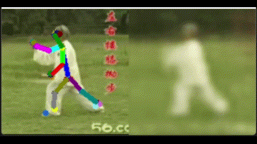

TP réalisé par BLUMET Thomas et HALVICK Thomas (Polytech Lyon - M2IA) 11/2024

# Aperçu




# Objectif de ce code
(Ce code est indépendant de tout le reste du dépôt)

À partir d'une vidéo d'une personne source et d'une autre d'une personne, notre objectif est de générer une nouvelle vidéo de la cible effectuant les mêmes mouvements que la source. 

[Allez voir le sujet du TP ici](http://alexandre.meyer.pages.univ-lyon1.fr/m2-apprentissage-profond-image/am/tp_dance/)

# How to run the code using the GenGAN trained network

Les poids du réseau GenGAN entraîné ont été enregistrés dans 2 fichiers en fonction du nombre d'epochs utilisées (ici 200 et 1000). Selon le cas, il faut donc juste modifier le fichier .pth à utiliser dans la fonction ```_init_``` (choisir sur la ligne ``` self.filename = 'data/Dance/DanceGenGAN200.pth'``` ou ```'data/Dance/DanceGenGAN1000.pth'``` ) . Pour observer l'aperçu que cela donne avec la lecture d'une vidéo (e.g. taichi2.mp4), il faut sélectionner `GEN_TYPE = 4` dans le fichier `DanceDemo.py`. En executant ce fichier, on obtient la génération succesive d'images se rapprochant le plus des postures présentes dans la vidéo.

# How to train the network
En fixant le booléen True dans le code suivant (situé à la fin du fichier `GenGAN.py`), la boucle d'entraînement est alors réalisé pour un nombre d'epochs fixé :
``` 
    if True:    # train=True or load=False
        # Train
        gen = GenGAN(targetVideoSke, False)
        gen.train(1000) #200)
    else:
        # load from file 
        gen = GenGAN(targetVideoSke, loadFromFile=True)    
```

# What we did concretly ?
Le TP a eu pour principal objectif d'introduire l'utilisation de réseau de neurones GAN au travers de la reproduction de mouvements d'une personne (source) tirés d'une vidéo (ici des mouvements de karaté/taichi) et de les appliqués sur les mouvements d'une personne cible. Pour cela, le TP propose une évolution progessive :
1) Etape 1 : sans utiliser de réseau de neurones, le but a été de générer avec le fichier DemoDance.py, via la lecture d'une vidéo de mouvements, un dataset d'images (près de 15 000 stockées dans le dossier data/taichi1 ) représentant les différentes postures d'une personne source. À chacunes de ces images, un réseau pré-entraîné va associer un `skeleton` qui est l'extraction, sous forme de bâtons et de points d'articulation, des gestes de la personne sur l'image. Via la lecture d'une autre vidéo (dite cible), l'objectif est de détecter parmi l'ensemble du dataset quel squelette, et donc quelle image, va correspondre le plus fidèlement au gestes réalisés à un instant t par la personne présente dans la vidéo cible, gestes qui sont eux-mêmes retranscris sous forme de squelette. Il s'agit ainsi d'une simple comparaison entre squelette source et cible (détection du plus proche squelette): c'est ce qui a d'ailleurs été fait dans l'implémentation de la fonction `generate` du fichier `GenNearest.py`.
Cette solution est simple (uniquement un parcours de dataset) mais peu efficace lorsque l'on a à disposition un très grand nombre d'images source afin d'obtenir un rendu assez satisfaisant (e.g du cas où la personne source lève légèrement la jambe parmi l'ensemble de ses gestes, ce qui n'est pas forcément le cas pour la personne cible malgré qu'une grande majorité des autres gestes concordent entre elles). En effet cela semble assez compliqué s'il s'agit d'une vidéo plus longue, nécessitant le stockage d'un dataset énorme, et dont le parcours se complexifie (en terme de temps ainsi que pour la comparaison des squelettes)

2) Etape 2 : dans l'objectif d'améliorer le rendu final cette fois, on entraîne un réseau de neurones qui génère à partir des coordonnées d'un squelette, dans un premier temps, une image transcrivant les gestes de ce squelette . Pour cela, nous avons codé dans le fichier `GenVanillaNN.py` la boucle de `train`ainsi que le model du réseau `GenNNSkeToImage`.

3) Etape finale : la réalisation du réseau GAN qui a pour objectif d'améliorer la génération d'image du Generator à partir de squelettes, ceci à l'aide d'un discriminator. Celui-ci vise à distinguer si l'image générée par le Generator est fake ou non, le Generator visant alors à "tromper" le Discriminator en rendant l'image générée la plus vraie possible. En reprenant la classe `GenNNSkeToImage`en tant que Generator d'image fake à partir d'un squelette, nous avons codé le model du réseau du ` Discriminator` ainsi que la boucle d'entraînement du GAN.
